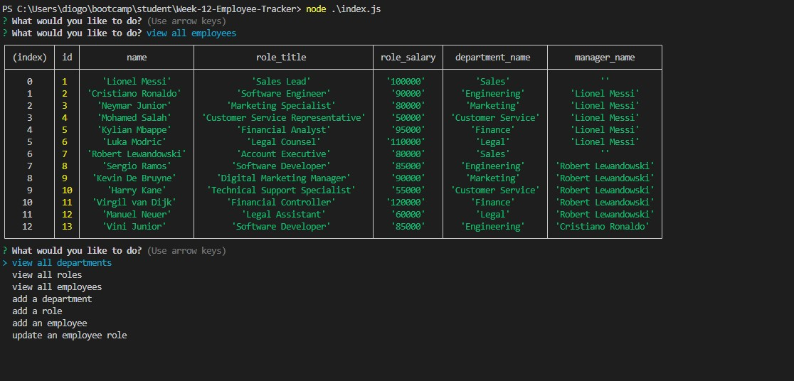

# Employee Tracker

## User Story

```md
AS A business owner
I WANT to be able to view and manage the departments, roles, and employees in my company
SO THAT I can organize and plan my business
```

## Acceptance Criteria

```md
GIVEN a command-line application that accepts user input
WHEN I start the application
THEN I am presented with the following options: view all departments, view all roles, view all employees, add a department, add a role, add an employee, and update an employee role
WHEN I choose to view all departments
THEN I am presented with a formatted table showing department names and department ids
WHEN I choose to view all roles
THEN I am presented with the job title, role id, the department that role belongs to, and the salary for that role
WHEN I choose to view all employees
THEN I am presented with a formatted table showing employee data, including employee ids, first names, last names, job titles, departments, salaries, and managers that the employees report to
WHEN I choose to add a department
THEN I am prompted to enter the name of the department and that department is added to the database
WHEN I choose to add a role
THEN I am prompted to enter the name, salary, and department for the role and that role is added to the database
WHEN I choose to add an employee
THEN I am prompted to enter the employee’s first name, last name, role, and manager, and that employee is added to the database
WHEN I choose to update an employee role
THEN I am prompted to select an employee to update and their new role and this information is updated in the database 
```

## Description

This project consists in a Employee Tracker that willd allow you to track your employees names, roles, salarys, assigned managers, departments and even let you update their roles. With this interactive database you will be able to get the information sorted in a easier way to understand and see the information. THis project contains 2 SQl files and 4 JavaScript files that are the ones giving the function.

This found multiple challenges during this project , since it was the hardest one untill now in my opinion. The biggest challenge was time management since this was a really big project that took some time to code it and there was no starter code during this week so it was definitly way harder to organise everything , to understand from where i should start and what i should do exactly. Another big challenge i faced was when i was having an issue that looked like i was not going to be able to solve it that took me 7 hours to actually solve it and get it fixed and the pressure and the frustration were affecting my way of thinking so i would say it was really hard.

This challenge helped me a lot because i felt way more confident after finishing and getting it to work, because i noticed the long way i have come and see that i was able to make something of this size and magnitude made me proud of myself and made me way more confident. ANother thing that this challenge helped me was my improvment in finding and solving issues since i had a pretty high number of issues and in the end i was able to fix them and get the project to work. I will also be listing other positive points in where this challenge helped me.

* Higher understanding of DataBases
* Higher understanding of Mysql
* Better JavaScript prespective

## Table of Contents

- [Installation](#installation)
- [Usage](#usage)
- [Tests](#tests)
- [License](#license)
- [Questions](#questions)

## Installation

To install the necessary dependencies, run the following command:
```
npm i inquirer@8.2.4
npm i mysql2
```

## Usage

TO use this repository is pretty simple. All you just have to do is clone it, and soon as you clone it you will neeed to open your terminal and run (npm i inquirer@8.2.4) and (npm i mysql2). Soon as you runned this 2 commands you will need to run your mysql and login by running the command (mysql -u root -p) then you will be asked for your mysql password that you will have to insert. After getting in on mysql you will have to run the follow commands (source/db/schema.sql) and after that you will run (source/db/seeds.sql). After running those you just leave by typing (quit;) and then you can run node index.js to get the options like view department, view roles, view employees , add (role,employee,department) and the update employee role.



## Tests

I will be listing the tests i have done.
```
Tested - view all departments
Tested - view all roles
Tested - view all employees
Tested - add a department
Tested - add a role
Tested - add a employee
Tested - Update an employee role
```

## License


This project is licensed under the MIT license.

## Questions

For any questions or inquiries, feel free to reach out to me:
- GitHub: [DiogoS77](https://github.com/DiogoS77)
- Email: diogo.messi.18@hotmail.com
- [Watch the Video](https://drive.google.com/file/d/1e6ob4P8SQQPTGWkBawgpdWURFybtwtsB/view)